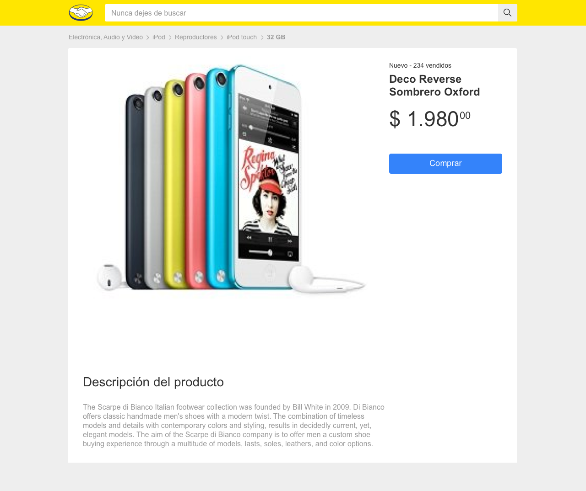

# Desafio Meli

Desafio feito em React com NextJS usando Typescript.

Importante ter o [Node.js](https://nodejs.org/) v12+ instalado.

Executando em desenvolvimento (instalando as dependências e rodando o server):

```sh
$ yarn ou npm install
$ yarn dev ou npm dev
```

Executando para produção (instalando as dependências e rodando o server):
> Instale as dependências caso não tenha feito anteriormente

```sh
$ yarn ou npm install
$ yarn build ou npm build
$ yarn start ou npm start
```

# Observações
Neste exemplo só temos dois items para pesquisa e a pesquisa está só sendo feita pelo título do item.

Tente pesquisar por iphone por exemplo.

# Gabarito oficial


